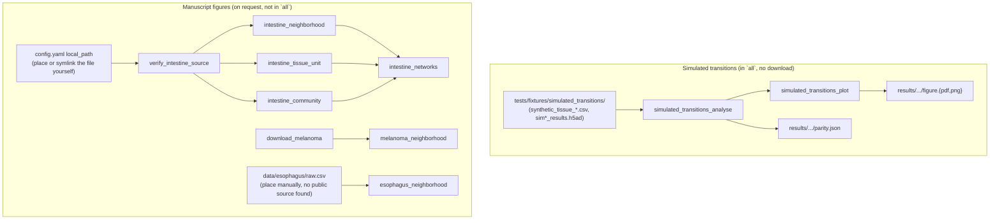

## MINGL

**Kyra Van Batavia¹, James Wright²˒³, Annette Chen¹, Yuexi Li¹, John W. Hickey¹\***

¹ Department of Biomedical Engineering, Duke University, Durham, NC, USA
² Department of Computer Science, Duke University, Durham, NC, USA
³ Department of Mathematics, Duke University, Durham, NC, USA

\* **Corresponding author:** john.hickey@duke.edu
**Contributing authors:** kyra.vanbatavia@duke.edu; james.wright@duke.edu; annette.chen@duke.edu; yuexi.li@duke.edu

**Preprint:** https://www.biorxiv.org/content/10.64898/2026.03.24.713296v1
**Upstream repository:** https://github.com/HickeyLab/Mingl

This fork keeps the Hickey Lab's `mingl` package and adds a Snakemake
workflow that reproduces the manuscript's figures from configuration,
replacing the original notebooks. Credit for the method and the underlying
biology belongs to
the authors above; this fork's own additions are the workflow, config,
tests and the bug fixes listed under "Differences from upstream".


## Abstract

MINGL is Mixture-based Identification of Neighbourhood Gradients with
Likelihood estimates: a probabilistic framework that converts existing
neighbourhood annotations into continuous per-cell membership scores across
hierarchical tissue units, rather than a single hard assignment. Those
scores locate border cells at unit interfaces, drive interaction networks
across hierarchical scales, quantify gradient transitions between units,
and measure context-specific composition heterogeneity, evaluated across
melanoma, healthy intestine and Barrett's oesophagus progression datasets.
The full abstract is in the preprint linked above.


## Reproducing the manuscript figures

```bash
pixi install       # solves and creates the environment (linux-64)
pixi run test       # pytest: unit tests plus a Snakemake DAG dry-run check
pixi run lint        # ruff check + ruff format --check + pyrefly check
pixi run smoke       # the full DAG on a small in-repo fixture, under a minute
pixi run all         # the full DAG on real data (see "Data availability" below)
```

`pixi run all` reproduces the simulated-transitions sweep end to end
(`results/simulated_transitions/{fast,medium,slow}/`); it does not attempt
the intestine, melanoma or esophagus figures, since melanoma and esophagus
data does not ship with this repository, and the intestine file, when
present, is large enough that requesting it by name is more deliberate than
folding it into the default target. Once `config.yaml`'s
`datasets.intestine.source.local_path` points at a real file (see "Data
availability" below), ask for its figures explicitly:

```bash
pixi run snakemake --cores 6 \
    results/intestine/neighborhood/adata.h5ad \
    results/intestine/tissue_unit/adata.h5ad \
    results/intestine/community/adata.h5ad \
    results/intestine/networks/summary.json
```

### Workflow DAG



### Configuration

`config/config.yaml` lists every parameter, seed and data source the
notebooks hardcoded: cluster/neighbourhood/region column names, k-window
sizes, thresholds, and each dataset's documented source with a SHA-256 field
that a `download_*` rule fills and checks. `config/smoke.yaml` layers on top
(`snakemake --configfile config/config.yaml config/smoke.yaml`) and
restricts the simulated-transitions target to one variant.

## Data availability

| Dataset | Best-attested public source | Status |
|---|---|---|
| Intestine (Hickey et al. 2023, *Nature*; HuBMAP CODEX) | Dryad [10.5061/dryad.pk0p2ngrf](https://doi.org/10.5061/dryad.pk0p2ngrf), `23_09_CODEX_HuBMAP_alldata_Dryad_merged.csv` (2.9 GB) | Obtained (browser-authenticated download); SHA-256-pinned in `config.yaml`; the `intestine_*` rules run on it |
| Melanoma | Dryad [10.5061/dryad.k0p2ngfcc](https://doi.org/10.5061/dryad.k0p2ngfcc), `23_10_11_Melanoma_Marker_Cell_Neighborhood.csv` (5.0 GB) | Identity confirmed (filename matches the notebook's exactly); manual download only, see below |
| Esophagus (Barrett's progression) | Not identified | No URL, DOI or portal reference exists anywhere in the deleted notebooks; only the local filename `all_regions_from_h5mu.csv`. Place a file at `data/esophagus/raw.csv` to run `esophagus_neighborhood`. |

**Manual download for melanoma:** Dryad's file identity was confirmed via
its own API (`GET /api/v2/datasets/doi:...` returns each dataset's title and
file listing, matching the manuscript exactly), and that listing is public,
but Dryad's actual file download endpoints (`/api/v2/files/<id>/download`
and the legacy `/downloads/file_stream/<id>`) sit behind an AWS WAF
challenge that returns `401`/`403` to unauthenticated programmatic requests
and cannot be scripted around. Download it through a browser, place it at
`data/melanoma/raw.csv`, compute its SHA-256, and put that in `config.yaml`;
`melanoma_neighborhood` then runs the same pipeline as the intestine rules.
The intestine file above was obtained the same way.

**Where the intestine file goes:** `config.yaml`'s
`datasets.intestine.source.local_path` is a relative path,
`data/raw/intestine/23_09_CODEX_HuBMAP_alldata_Dryad_merged.csv`; `data/` is
gitignored (see below), so put the real file there yourself, or symlink it
in from wherever it actually lives (this file may be large and shared with
other workflows on your machine; nothing about that is specific to this
repository). If it is shared with concurrent workflows, set `lock_path` in
config (or the `MINGL_LOCK_PATH` environment variable) to a lock file and
every rule that reads it wraps its command in `flock` around that path;
unset (the default), rules run unlocked, which is correct for a single-user
checkout or CI.

**Row count does not match the deleted notebooks exactly.** The Dryad file
has 2,603,217 cells; the notebooks' own stored output
(`AnnData ... n_obs × n_vars = 2512002 × 0`, in
`fig2_intestine_tissue_unit.md`) has 2,512,002, about 3.6% fewer. The
notebooks' AnnData also has columns absent from the Dryad file entirely
(`first_index`, `neigh_name`, `neigh_sub1`, `Preservation_method`), so the
notebooks read a further-processed local copy (donor metadata merged in,
some filter applied) rather than this file directly; that processing step
happened upstream of the tutorials and is not recoverable from anything this
repository or the deleted notebooks contain. The Dryad file is still the
right, confirmed-identity public source: its columns and `unique_region`
values (`B004_Ascending`, `B006_Descending - Sigmoid`, ...) match exactly,
and it already has the manuscript's own precomputed `Neighborhood`/`Community`/
`Tissue Unit` assignments, needing no derivation step of its own. Real
computation on it is real, sourced analysis on a confirmed-identity file; it
is just not a bit-exact match for the notebooks' own copy. See the parity
table below.

A cell missing its `Tissue Unit` label (a real, biological gap: not every
cell sits within the mucosa/submucosa/muscularis segmentation) cannot
contribute to or be scored against a tissue-unit centroid, so
`intestine_tissue_unit` drops it. After dropping, its cell count is
2,512,185, 183 cells (0.007%) away from the notebook's own 2,512,002 for
this exact stage. That is far closer than the raw file's 3.6% gap, and is
itself evidence for what the notebooks' extra filtering mostly did.

The in-repo `tests/fixtures/simulated_transitions/` fixture remains this
workflow's only bit-exact parity target: the deleted
`SyntheticGradientTest{Fast,Medium,Slow}.ipynb` notebooks' own stored output
(seed=42, `k=10`, per `FunctionsSimulator.ipynb`). It is what
`pixi run smoke` and `pixi run all` execute by default.

## Parity with the notebooks

`tests/test_parity.py` and the `simulated_transitions_analyse` rule
re-run `centroid_Calculation` + `cpu_gmm_probability` (k=10) on the shipped
synthetic fixtures and compare the result against each notebook's own
stored `neighborhood_probabilities` output:

| Variant | Pearson r | Max abs. diff | Argmax agreement |
|---|---|---|---|
| fast | 1.0 | 5.6e-16 | 1.0 |
| medium | 1.0 | 5.6e-16 | 1.0 |
| slow | 1.0 | 6.1e-16 | 1.0 |

The differences are floating-point noise (`1e-16`, machine epsilon for
float64), so this reproduces the notebooks' own output exactly. Full
per-notebook output extraction (including the manuscript-figure notebooks,
which have no directly comparable stored numeric output beyond figures) is
recorded outside this repository; see the "Differences from upstream"
section for what those notebooks actually computed and could not be
independently re-run against.

### Real intestine results (fig2, fig3, fig4, fig6)

`intestine_neighborhood`, `intestine_tissue_unit`, `intestine_community`,
`intestine_networks` and the `n_neighborhood` sweep have all run on the
real, confirmed-identity Dryad file (see "Data availability"), on a
uniformly-filtered, reconstructed cell universe (below), with a direct
numeric comparison against the notebooks' own stored output, not just
matching row counts or "plausible" results.

**Reconstructing the notebooks' filter.** The notebooks' own stored output
reports 2,512,002 cells; this file has 2,603,217. No column but
`Tissue Unit` has any missing value anywhere in the file (checked
directly), and dropping the 91,032 cells missing it leaves 2,512,185 -- 183
away (0.007%) from the notebooks' figure, the closest reconstruction found
(the exact remaining 183-cell gap stays unexplained; see "Data
availability"). `intestine_filtered_source` applies that filter once,
so every stage below scores the same 2,512,185 cells, rather than each
stage silently filtering (or not) by whichever column it happens to need.
Cross-checked against fig4's own stored per-region totals, independent of
the reconstruction above: 4 of 5 spot-checked regions match exactly
(B004_Ascending 21,232; B012_Sigmoid 51,593; B012_Trans 27,784; B008_Sigmoid
43,783), one is off by 2 cells out of 30,545 (B004_Descending).

**Centroid matrix: exact numeric match.** `fig2_intestine_tissue_unit`'s
stored output has `centroid_Calculation`'s full 4x20 `Tissue Unit` x
`Community` mean/std table (k=300); `intestine_tissue_unit` now keeps its
own in `uns["neighborhood_centroids"]`. Every mean checked matches to
4-5 significant figures (for example, Mucosa x Plasma Cell Enriched:
82.852776 vs 82.851212; Submucosa x Stroma: 226.738037 vs 226.737946),
with the residual fully consistent with the 183-cell filter difference
above. Full comparison: `~/planning/Mingl/parity.md`.

| Level | Cells scored | Groups | Border cells (≥2 memberships above 0.25) |
|---|---|---|---|
| Neighbourhood (`Cell Type` → `Neighborhood`, k=10) | 2,512,185 | 20 | 291,489 (11.6%) |
| Community (`Neighborhood` → `Community`, k=100) | 2,512,185 | 10 | 179,846 (7.2%) |
| Tissue unit (`Community` → `Tissue Unit`, k=300) | 2,512,185 | 4 (Mucosa, Submucosa, Muscularis mucosa, Muscularis externa) | 290,190 (11.6%) |

`intestine_networks` (fig3) built each level's top-15 neighbourhood-pair
interaction graph from these; the strongest pairs are biologically
sensible, for example "Microvasculature ⟷ Macrovasculature" and
"Innervated Smooth Muscle ⟷ Smooth Muscle" at the neighbourhood level. No
upstream stored edge-weight numbers exist to check this against (the
notebook's own "Edge summary" output has nothing captured beneath its
header), so this is real computation without an upstream number to
validate it against, stated as such rather than left looking checked.
Full output: `results/intestine/networks/summary.json`.

fig4's own numeric outputs (a percentile-bin table, k-window exclusion
diagnostics) come from `mingl_neighborhoods_scverse` (`tl/grad.py`), a
materially different computation from the pipeline the three rules above
share; wiring it up as a further rule was not attempted this round.

**fig6.** Staged rather than skipped: `intestine_n_neighborhood_windows`
computes the k=10 composition window once; `intestine_n_neighborhood_cluster`
is one job per candidate cluster count `n`, defined across the notebook's
full 1..50 sweep (`intestine_n_neighborhood_full_sweep`) so the DAG has a
job per n regardless of which are requested, each independently well under
the 30-minute-per-computation limit (each n reclusters the one cached
window; wall time per n grows with n, from ~25 s at small n to a few
minutes at n near 50 -- one KNN2 pass total, not one per n. Compared against
the notebook's own selection (`fig6_intestine_n_neighborhood.md`: "Cluster
4 from Probability Elbow N=6: 460505 cells ... Selected N=17: 209003 cells
... Log-Likelihood Elbow N=28: 139182 cells"):

| n | This run's closest cluster | Cells | Notebook's cluster | Cells | Match |
|---|---|---|---|---|---|
| 6 | cluster "4" | 446,765 | cluster 4 (probability elbow) | 460,505 | within 3.0% |

n=17 and n=28 were still running at the time of writing (the full 1..50
sweep continues unattended in the background; `results/intestine/
n_neighborhood/n{17,28}.json` will exist once each finishes). Cluster IDs
themselves are not expected to match (`MiniBatchKMeans` label assignment
depends on mini-batch draw order, not just the seed), so this table
compares by cell count, closest cluster to closest cluster, not by label.

## Differences from upstream

Bug fixes, each in its own commit with a regression test:

1. **GPU/CPU probability parity** (`tl/gmm_gpu.py`). `gpu_gmm_probability`
   called `KNN2` without `ks`, so it scored a different k-window set than
   `cpu_gmm_probability` (`ks=(10, 20, 100, 300)` vs KNN2's own default
   `(5, 10, 20, 100, 300)`), and it skipped the CPU path's required-column
   validation. Both are now aligned, and `gpu_gmm_probability` gained a
   `copy` parameter to match. Untested on real hardware: this machine has no
   GPU; `tests/test_gmm_gpu.py` skips its CuPy-dependent checks and always
   runs its signature/default checks.
2. **Deprecated, silently-ignored `threshold`** (`tl/gmm.py`).
   `cpu_gmm_probability`'s `threshold` parameter was `del`eted unused.
   Passing a non-default value now raises a `DeprecationWarning`;
   thresholding happens downstream, in `findPositives`.
3. **`KNN2` gained an optional `max_distance`** (`tl/knn2.py`). The README
   used to say `knn2.py` applies a maximum-distance threshold; it had none.
   The thresholded version lived only in `Neighborhoods.k_windows`
   (`tl/grad.py`). Both now share one summation helper
   (`knn2._sum_windows`), so `KNN2(..., max_distance=...)` and
   `Neighborhoods.k_windows(distance_max=...)` agree by construction, and
   `max_distance=None` (the default) reproduces the original, unthresholded
   behaviour exactly.
4. **Manuscript-specific defaults removed from public signatures.**
   `gb()`'s `region_value` no longer defaults to `"B006_Descending -
   Sigmoid"` (it defaults to `None`, matching the underlying
   `gb_local_score_gradients`); `mingl_neighborhoods_scverse`'s `tu1`/`tu2`
   (formerly defaulting to `"Inner Follicle"`/`"Outer Follicle"`) are now
   required, positional arguments, since no generic default is sensible;
   `crd()`'s hardcoded `'cellid'`/`'region'`/`'neigh_name'` column names are
   now `cellid_col`/`region_col`/`neigh_name_col` parameters (defaulting to
   the same strings, so existing callers are unaffected). All manuscript
   values now live in `config/config.yaml` instead.
5. **Dead driver script removed** (`tl/n_neighbors.py`): a commented-out
   block referencing `/Volumes/data/MINGLE/...`, an absolute path from the
   original author's machine.
6. **Repository hygiene**: removed tracked `tests/__pycache__/*.pyc` and
   `tools/__pycache__/*.pyc`; removed `tests/test_basic.py`'s two skipped
   tests referencing a nonexistent `mingl.pp.elaborate_example`; removed a
   stray `biome.jsonc` (a JS/TS formatter config with nothing in this Python
   repository to format) and a dead trailing string literal in
   `pp/preprocessing.py` (an unreachable, commented-out `.h5mu` branch); the
   README's broken Actions link is fixed by this repository's own
   `.github/workflows/ci.yml`.
7. **In-place `AnnData` mutation**: `cpu_gmm_probability` and
   `gpu_gmm_probability` gained a `copy: bool = False` parameter (documented
   in each docstring); the default preserves the original in-place
   behaviour.
8. **Non-string `cluster_col` values broke `centroid_Calculation` and
   `cpu_gmm_probability`** (`tl/centroids.py`, `tl/gmm.py`), found while
   building the parity harness above: `KNN2`'s window columns are always
   strings (it strips a `"{cluster_col}__"` prefix off pandas
   `get_dummies()` column names), but both functions indexed those columns
   with the raw `adata.obs[cluster_col]` values, raising a `KeyError` or
   `ValueError` whenever `cluster_col` contained integers (a common encoding for
   cell-type ids, and exactly what the SimulatedTransitions fixtures use).
   Both now cast to `str` first, matching KNN2's own convention.
9. **`KNN2` and `Neighborhoods.k_windows` (`tl/grad.py`) broke on a
   non-contiguous obs index**, found while running `intestine_tissue_unit`
   on real data (missing-`Tissue Unit` rows dropped without resetting the
   index): both mapped k-NN results, computed *positionally*, back to
   `tissue.obs.index` *labels*, then used those labels as positions into a
   separate, plain positional array. That is only correct when an AnnData's
   obs index happens to already be a fresh `0..n-1` `RangeIndex`; any
   caller who filters first (`dropna`, a boolean mask, ...) keeps the
   original, now non-contiguous labels, which raised `IndexError` or
   silently indexed the wrong row. Filtering an AnnData before calling
   either function hits this for any caller, not just this workflow, so it
   is fixed in the library: both now track true global positions throughout,
   converting to labels only in the final, label-indexed output.
10. **`centroid_Calculation` and `KNN2` broke on missing labels**, found
    the same way: a cell missing `cluster_col`/`neighborhood_col` cannot
    contribute a labelled feature count or be assigned to a named centroid
    (`centroid_Calculation` now drops such rows first; a `NaN`
    `neighborhood_col` value used to become a `NaN`-named centroid, which
    crashed any code copying centroid names into new `.obs` columns --
    `gpu_gmm_probability` does this natively -- when writing to h5ad). A
    cell missing `region_key` cannot receive a spatial window at all
    (`KNN2` now drops it); a categorical `region_key` can also list
    unused categories after such a drop, and `groupby`'s default
    `observed=False` still yielded an empty group for those while
    `.unique()` excluded them, raising `"<region> is not in list"` (`KNN2`
    now calls `.cat.remove_unused_categories()` after the drop).

Intentional deviations, not bugs:

- The workflow calls `cpu_gmm_probability` everywhere, including for the
  manuscript figures the notebooks computed via `gpu_gmm.gpu_gmm_probability`
  (`intestine_tissue_unit`, `intestine_community`, `intestine_neighborhood`
  in `workflow/rules/manuscript_figures.smk`): this machine has no GPU. The
  two paths are mathematically identical after fix (1) above, and
  `tests/test_parity.py` demonstrates `cpu_gmm_probability` reproduces
  stored notebook output exactly on the one fixture this repository can
  compare against.
- `pixi run lint`'s pyrefly check excludes `tl/gmm_gpu.py` (imports `cupy`
  unconditionally; nothing here can import it) and `pl/enrichment.py` (two
  pre-existing `not-iterable` errors trace to a helper this task's confirmed
  bug list does not cover, and rewriting it without a test protecting its
  behaviour was out of scope). `pyproject.toml`'s `[tool.ruff]` and
  `[tool.pyrefly]` sections document, file by file, which further
  pre-existing style/typing categories in `pl/` and `tl/` are downgraded
  rather than silently rewritten, and why.
- `docs/notebooks/example.ipynb` (which called a nonexistent
  `mingl.pp.elaborate_example`, from the scverse cookiecutter template this
  package was generated from) is now `docs/notebooks/example.md`, a MyST
  notebook that runs the real `KNN2` -> `centroid_Calculation` ->
  `cpu_gmm_probability` pipeline on a small synthetic AnnData built in
  place, and executes on every docs build (`nb_execution_mode = "cache"`).

## Package structure

| Module | Description |
|---|---|
| `mingl.pp` | Preprocessing utilities for preparing spatial datasets |
| `mingl.tl` | Core analysis tools: probability estimation, border identification, gradients, interaction networks, heterogeneity analysis, neighbourhood-count selection |
| `mingl.pl` | Publication-quality plotting functions for visualising MINGL analyses |
| `workflow/` | The Snakemake workflow (`Snakefile`, `rules/*.smk`, `scripts/*.py`) that replaces the deleted tutorial notebooks |
| `config/` | `config.yaml` (full run) and `smoke.yaml` (small-fixture override) |
| `tests/` | Unit tests, the simulated-transitions parity check, and a Snakemake dry-run check; `tests/fixtures/` has the small in-repo fixture |

See `docs/api.md` for the full function reference (its prose still
describes the k=10/100/300 neighbourhood/community/tissue-unit convention
by the tutorial figures that established it; those figures are now
`workflow/rules/manuscript_figures.smk`, with every value taken from
`config.yaml` instead of hardcoded).

## Installation

MINGL is distributed through PyPI and GitHub as an installable Python
package (`pip install mingle-hl`, or `pip install .` from a clone); the
workflow above is the reproducible-research layer built on top of it and
needs pixi, not pip, to run. See `pyproject.toml` for the package's own
dependencies.

## Machine requirements for the workflow

CPU only; every rule targets under 6 cores and well under the 30-minute
runtime `pixi run smoke`/`pixi run all` actually take (well under a minute
and well under a minute respectively, on this machine). The manuscript
figure rules, once real data is in place, have not been runtime-profiled
here.

## Licence

MIT, see `LICENSE`. Upstream (HickeyLab/Mingl) publishes under the same
licence; this fork keeps it unchanged.

## Citation

> t.b.a. (see the preprint above)

## Need help?

For installation questions, bug reports, or feature requests on the
upstream package, open an issue at
https://github.com/HickeyLab/Mingl/issues. Workflow-specific issues (this
fork's `config/`, `workflow/`, or CI) belong in this fork.
